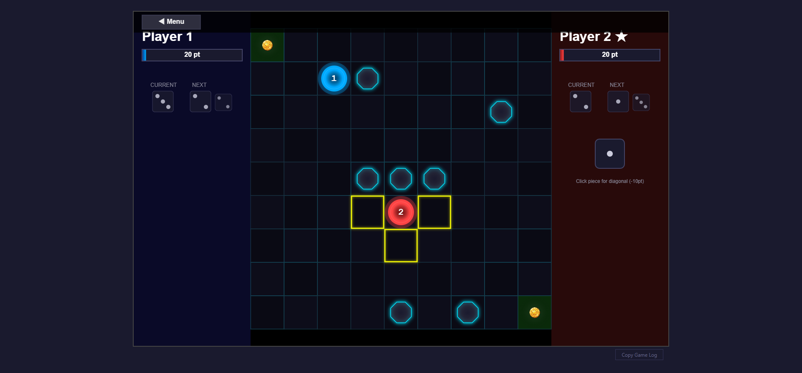
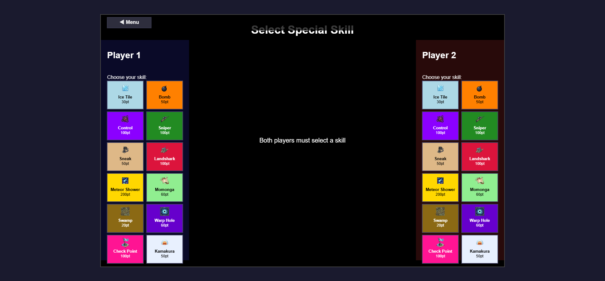
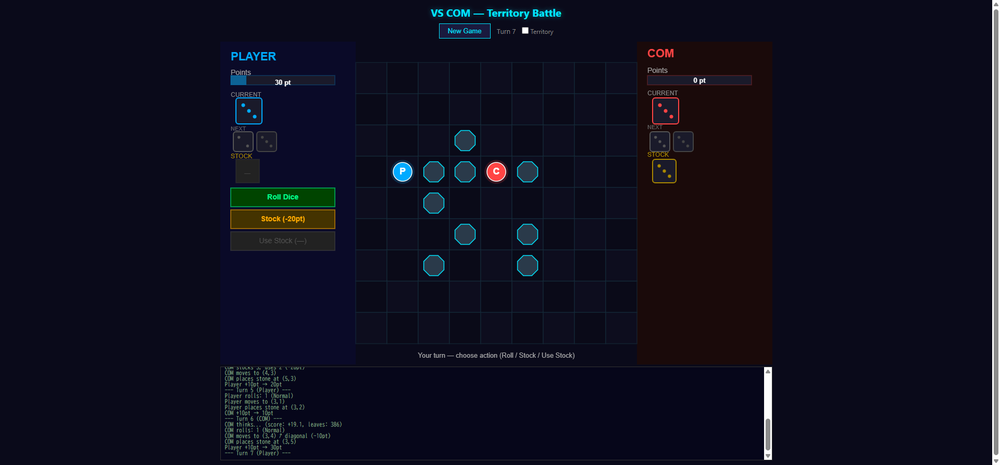
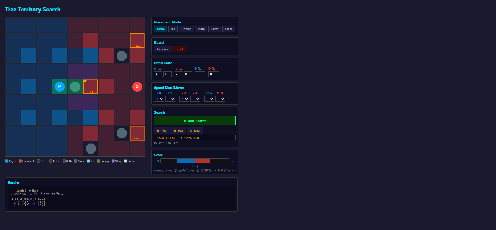

# Nine-Nine — Territory Battle

> 9×9 盤面上でサイコロと戦略で領域を奪い合う、ターン制ボードゲーム

<p align="center">
  <a href="https://nine-nine-project.pages.dev/"><strong>Play Now</strong></a>
</p>

<p align="center">
  
  
  
  
</p>

---

## Screenshots

### Gameplay — 移動ハイライト & ダイスUI


### スキル選択画面 — 12種類の固有スキル


### VS COM — Minimax AIとの対戦


### Research Tools — テリトリー評価 & Minimax探索


---

## About

**Nine-Nine** は、HTML5 Canvas で描画されるサイバーダークテーマの対戦型ボードゲームです。プレイヤーはサイコロの出目に応じて盤面を移動し、石やトラップを配置して相手を追い詰めます。12種類のスキル、COM AI、リプレイ機能を搭載しています。

### 勝利条件

相手を以下のいずれかの状態に追い込めば勝利:

- 盤外に押し出す
- 爆弾タイルを踏ませる
- 移動不能にする
- 配置不能にする

---

## Features

### Core Gameplay

| 要素 | 内容 |
|------|------|
| **盤面** | 9×9 グリッド、石・ファウンテン・各種トラップ |
| **移動** | サイコロ（1〜3）× 8方向（十字＋斜め） |
| **配置** | ターン毎に隣接マスへオブジェクトを1つ配置 |
| **ポイント** | ターンボーナス +10pt / 斜め移動 -10pt / ファウンテン +20pt |
| **ストック** | サイコロを20ptで保存、好きなタイミングで使用 |
| **ドリル** | 100ptで隣接する石を破壊 |

### 12 Skills

各プレイヤーが試合前に1つ選択する固有スキル:

| スキル | コスト | 効果 |
|--------|-------:|------|
| Ice Tile | 30pt | 氷タイルを設置（踏むと移動距離+1） |
| Bomb | 50pt | 爆弾タイルを設置（踏むと即敗北） |
| Swamp | 20pt | 沼タイルを設置（相手の移動距離を減少） |
| Sneak | 50pt | 斜め1マス移動（石の配置なし） |
| Warp Hole | 60pt | ワープを設置（相手をランダム位置へ転送） |
| Momonga | 60pt | 最寄りの石へテレポート |
| Checkpoint | 100pt | チェックポイント設置 or 隣接石を破壊 |
| Sniper | 100pt | 4マス以上離れた直線上の相手を狙撃 |
| Control | 100pt | 相手のスキル＆ストックを3ターン封印 |
| Landshark | 100pt | 隣接する相手を排除 |
| Kamakura | 50pt | U字型の石を雪タイルに変換 |
| Meteor Shower | 200pt | 盤面の任意の位置に石を配置 |

### COM AI

- **3段階の難易度**: Easy / Normal / Hard
- テリトリー評価（BFS flood-fill）による盤面判断
- スキル使用タイミングの最適化
- 移動・配置の戦略的意思決定

### Replay System

- 全ターンの操作を記録・再生
- JSON形式でエクスポート/インポート
- フェーズ単位のステップ再生

---

## Research Tools

COM AIのアルゴリズム開発に使用した研究ツール群（`research/`）:

| ツール | 用途 |
|--------|------|
| **Move Search** | 移動候補のツリー探索・分岐可視化 |
| **Tree Territory** | Minimax探索 + テリトリー評価の検証 |
| **VS COM** | Minimax AIとの対戦テスト（スキルなし） |
| **Score Eval** | 盤面スコア評価のビジュアライズ |
| **Fountain Rush** | ファウンテン到達の最適経路分析 |

---

## Tech Stack

```
Frontend:   Vanilla JavaScript (ES6+) / HTML5 Canvas
Style:      Cyber-dark theme (手描き Canvas UI)
AI:         Territory BFS + Minimax (depth-4, D2×O2 列挙)
Structure:  モジュール分割 (11 JS files, ~12,500 lines)
Dev Tools:  5 interactive research HTML tools
```

### Architecture

```
index.html          ← エントリーポイント
js/
├── main.js         ← イベントハンドリング・ゲームループ
├── game.js         ← ゲーム状態管理・ターンフロー
├── board.js        ← 盤面操作・タイル管理
├── player.js       ← プレイヤー状態・ダイスキュー
├── renderer.js     ← Canvas描画エンジン
├── com.js          ← COM AI 意思決定
├── animation.js    ← 移動アニメーション
├── replay.js       ← リプレイエンジン
├── gamelog.js      ← ターンログ記録
├── settings.js     ← 設定管理
└── constants.js    ← 定数・スキル定義
css/style.css       ← レイアウト
assets/skills/      ← スキルアイコン (15 images)
research/           ← AI研究ツール (5 HTML tools)
```

---

## Getting Started

```bash
# クローン
git clone https://github.com/Hawtzu/nine-nine-project.git
cd nine-nine-project

# 任意のHTTPサーバーで起動
npx http-server -p 8080
# or
python -m http.server 8080

# ブラウザで開く
open http://localhost:8080
```

---

## Development

Claude Code + Claude Code Actions で開発しています。

```bash
# PRで @claude メンションで自動レビュー・実装
@claude この機能を実装してください
@claude コードレビューをお願いします
```

---

## License

MIT
